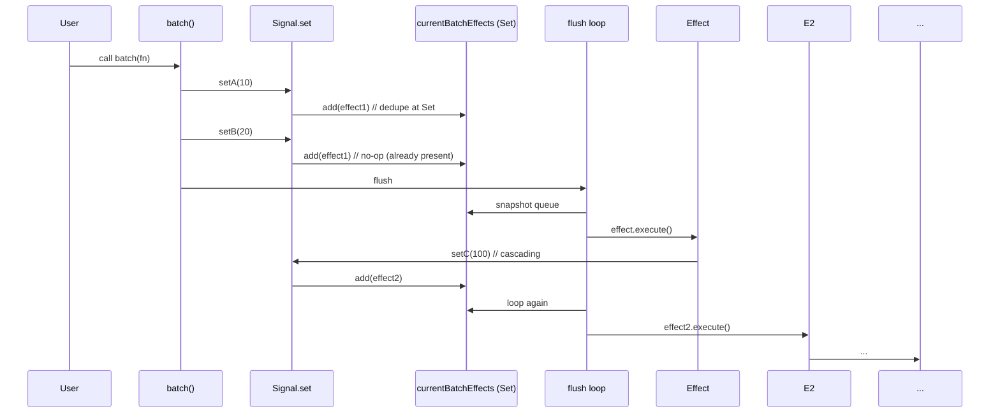

Good — let’s demystify the batch behavior, why it makes the system handle dedupe / cascading / nested things, what can go wrong in real apps, and how to mitigate the edge cases. I’ll explain the runtime flow first, then show multiple visualizations (ASCII, emoji, table, and mermaid), and finish with concrete edge cases + fixes and practical recommendations.

Short summary (TL;DR)

- Your implementation uses:
  - currentBatchEffects (a Set) to collect/ dedupe effects during a batch,
  - batchDepth counter so only the outermost batch creates & flushes that Set,
  - a flush loop (while Set not empty) to handle cascading updates,
  - listeners stack so reads subscribe the currently executing effect (correct nested tracking).
- This combination supports the four behaviors you listed. It’s a robust synchronous model for many real-world cases, but watch out for infinite cascades, async work, ordering assumptions, and long-running effects — I list fixes below.

1. How the `batch` / flush works (step-by-step)

- Data structures:
  - currentBatchEffects: Set<Effect> (deduplicates queued effects)
  - batchDepth: number (nesting counter)
  - listeners: stack (current executing effect(s))
- Key rules:
  - When you call batch(fn):
    - increment batchDepth
    - if batchDepth === 1 → create new Set assigned to currentBatchEffects
    - run fn()
    - if batchDepth === 1 → run flushCurrentBatchEffects() (process Set until empty)
    - decrement batchDepth and cleanup currentBatchEffects when leaving outermost batch
  - When a signal setter runs:
    - if currentBatchEffects !== null → add each subscriber (effect) to the Set
    - else → call subscriber.execute() immediately
  - flushCurrentBatchEffects loop:
    - while currentBatchEffects.size > 0:
      - snapshot = [...currentBatchEffects]
      - currentBatchEffects.clear()
      - for effect in snapshot: effect.execute()
      - (any effects triggered during these runs will add themselves to the live currentBatchEffects Set → next loop iteration)
  - createEffect(fn):
    - calls cleanup(effect)
    - pushes effect to listeners
    - runs fn() inside batch() if not already batching (this is a DX touch)
    - pops listeners

2. Why this implements the four behaviors

- Deduplication (automatic)

  - currentBatchEffects is a Set. Multiple signals call setX() and add the same effect — Set prevents duplicates, effect executes once.

- Cascading updates

  - When an effect runs it may set signals; those sets add effects into currentBatchEffects (if batching) which the flush loop keeps processing until no new effects are added. So cascades are handled in waves.

- Not losing effects triggered during flush

  - The flush loop clears the Set only after taking a snapshot. New effects are added to the live Set and will be processed in subsequent iterations. So nothing gets “lost”.

- Nested effects and memos
  - listeners stack: reads subscribe to listeners[listeners.length - 1], so nested createEffect/createMemo subscribe to the innermost effect/memo correctly.
  - createMemo implemented as a signal updated by an effect, so it composes with the same batching/tracking logic.

3. Visualizations

A. ASCII flow (write → queue → flush → execute → cascade)

```
Caller
  |
  | call batch(() => { setA(10); setB(20) })
  v
batch: batchDepth++  (batchDepth === 1) -> currentBatchEffects = Set{}
  |
setA(10):
  -> value updated
  -> subscribersSnapshot = [...subscribersOfA]
  -> for subscriber in snapshot: currentBatchEffects.add(subscriber)
setB(20): (same)
  |
end batch.fn()
  |
batch (outermost) -> flushCurrentBatchEffects():
  while currentBatchEffects.size > 0
    queue = [...currentBatchEffects]      // snapshot
    currentBatchEffects.clear()          // clear **after** snapshot
    for effect in queue:
      effect.execute()
        -> cleanup(effect)
        -> listeners.push(effect)
        -> run effect.fn()  (reads signals -> subscribes)
        -> effect.fn() might call setC(...) -> adds more effects to currentBatchEffects
        -> listeners.pop()
  loop again if currentBatchEffects.size > 0
batchDepth-- ; if 0 -> currentBatchEffects = null
```

B. Emoji flow summary

- Call batch: 🧺 -> start collecting
- set signal: 🔁 -> adds effect to set ➕ (dedupe)
- flush: 🔄 while there are effects
  - effect run: ⚡ -> may set signals 🔁 -> add more effects ➕
- done: ✅

Short emoji chain:
🧺 batch → 🔁 setA → ➕currentBatchEffects → 🔄 flush → ⚡ effect.execute → 🔁 setB → ➕ ... → ✅

C. Table: component → job → how it helps
| Component | Job / Behavior | Helps with |
|---------------------:|-------------------------------------------------------------|-----------------------------------------|
| currentBatchEffects | Set of effects queued during batching | Deduplication, queued execution |
| batchDepth | Nesting counter for batches | Nested batching, ensures outermost flush|
| flush loop | while (Set not empty) { snapshot; clear; execute snapshot } | Cascading updates, no lost effects |
| listeners (stack) | current effect that reads signals | Nested effects, correct subscriptions |
| createSignal.read | subscribe top-of-listeners | Automatic dependency tracking |
| createEffect.execute | cleanup, push listeners, run fn (batched) | Auto cleanup and re-subscription |
| createMemo | effect writes to internal signal | memoization + same reactive graph |

D. Mermaid diagrams

Flowchart (flush & cascading):

```mermaid
flowchart TD
  A[batch start] --> B{batchDepth===1?}
  B -- yes --> C[create currentBatchEffects Set]
  C --> D[run user fn]
  D --> E{any sets called?}
  E --> F[currentBatchEffects not empty] --> G[flush loop]
  G --> H[queue = [...Set]; Set.clear()]
  H --> I[for each effect in queue -> effect.execute()]
  I --> J{effect.execute() triggers sets?}
  J -- yes --> K[those sets add effects to currentBatchEffects]
  K --> G
  J -- no --> G
  G --> L[done when Set empty]
  L --> M[batch end, currentBatchEffects = null]
```

Sequence diagram (set -> queue -> flush -> effect -> cascade):



4. Edge cases, problems in real-world apps, and fixes

A. Infinite or runaway cascading loops

- Problem: Effects repeatedly set signals in a way that never stabilizes (A -> B -> A -> ...).
- Symptoms: flush loop never ends (infinite loop) or very large numbers of runs.
- Fixes:
  - Add a safety cap (max waves or max effect executions per flush) and throw or schedule async continuation:
    - e.g., count waves and if > 1000 -> throw or schedule a `setTimeout(() => { ... })` to break synchronous loop.
  - Detect no-op updates using equals comparator: if setX(new) is equal to old value (using equals) don’t queue effects.
  - Use change detection / update counters to stop repeated idempotent updates.

B. Long-running effects

- Problem: an effect takes long time CPU-blocking the event loop; since everything is synchronous the flush holds up program.
- Fixes:
  - Encourage small effects; if expensive work is needed, do it off-main (async / web worker).
  - Provide an option to schedule effects asynchronously (microtask or requestAnimationFrame) for “deferred” reactions.
  - Add a priority or scheduler that can split work into chunks.

C. Errors thrown inside effect.fn

- Problem: error could leave batchDepth out of sync or leave currentBatchEffects in a bad state.
- Observations in your code:
  - batch uses try/finally and decrements batchDepth in finally — good.
  - flushCurrentBatchEffects runs effects synchronously; if effect throws, no surrounding try/catch in flush will break out; there’s currentBatchEffects = null at the end — ensure flush wraps effect execution and continues (or fails intentionally).
- Fix:
  - Wrap effect.execute() in try/catch inside flush loop. Decide policy: stop flush and rethrow or record and continue to next effect. Typically rethrowing is fine but keep state consistent.

D. Async setters / effects (await inside effect)

- Problem: if effect performs async work and then calls setters later, those setters run outside the original synchronous batch, so they won’t be part of the same flush.
- Implication: your guarantee is strictly for synchronous updates inside a batch. Async updates will be scheduled later (fine), but be explicit.
- Fix:
  - If you want to batch across async boundaries, provide explicit API: batchAsync(async () => {...}) that awaits and then flushes at the end.
  - Or schedule microtask flushes with Promise.resolve().then(...) to flush queued updates asynchronously.

E. Ordering and deterministic runs

- Problem: Set is unordered (insertion order is preserved in JS sets? yes, but relying on it is brittle). The order in which effects run within a wave is not strictly constrained — only deduped.
- Fix:
  - If stable ordering is required, use an ordered queue rather than Set but still dedupe (maybe maintain Map order or store an index).
  - Or attach priority to effects.

F. Memory / subscription hygiene & O(1) removal

- Problem: If you use Sets of functions and do many subscribe/unsubscribe cycles, removing entries by scanning can be slow.
- Fix:
  - Use bidirectional arrays + slot indices to remove by swap-with-last for O(1). Your comments mention this optimization — consider implementing it if you need high perf on millions of binds.
  - Ensure cleanup always runs (on disposal, on re-run), and effect.subscriptions is cleared properly.

G. Re-entrancy: createEffect batching itself

- Problem: createEffect auto-wraps effect.fn in batch() for DX. That creates nested batches. Your batchDepth solution handles this: inner createEffect runs inside an existing batch => batchDepth > 1, so inner createEffect won't create/flush a new Set — correct behavior.
- Note: this is subtle but desired: initial run of effect still happens and will subscribe, but it doesn't break user batches.

H. Updater functions and equality checks

- Problem: set((v) => v + 1) always mutates; repeated sets may be idempotent if value equal; ensure equals detection used to avoid unnecessary effects.
- Fix:
  - Use comparator (equals) option and call equals(old, new) before queuing.

5. Concrete code suggestions and small improvements

A. Safety cap on flush iterations

```js
function flushCurrentBatchEffects() {
  if (!currentBatchEffects?.size) return;
  let wave = 0;
  const MAX_WAVES = 1000;
  while (currentBatchEffects.size > 0) {
    if (++wave > MAX_WAVES) {
      throw new Error(
        "Max reactive flush waves reached — possible infinite cascade"
      );
    }
    const queue = [...currentBatchEffects];
    currentBatchEffects.clear();
    for (const effect of queue) {
      try {
        effect.execute();
      } catch (err) {
        /* option: rethrow or collect */ throw err;
      }
    }
  }
  currentBatchEffects = null;
}
```

B. Wrap effect.execute() with try/catch if you want robustness and to continue other effects:

```js
for (const effect of queue) {
  try {
    effect.execute();
  } catch (err) {
    console.error("Effect error", err); /* continue */
  }
}
```

C. Optional async flush variant

- If you want to avoid long synchronous flush blocking UI, provide ability to schedule a microtask:

```js
if (shouldDefer) {
  Promise.resolve().then(() => flushCurrentBatchEffects());
} else {
  flushCurrentBatchEffects();
}
```

Make this an option on batch: batch(fn, { asyncFlush: true })

D. Batch IDs vs depth

- batchDepth approach (what you implemented) is the simplest and correct for nested batches. batchId approach can help when tracking which batch created an effect (for debugging / metrics) but is more complex.

E. Deterministic ordering

- If ordering matters, maintain an insertion-ordered queue plus a Set used only for membership check:
  - If effect not in Set -> push into Queue and Set.add
  - Flush by shifting from Queue -> Set.delete
  - This preserves insertion order but still dedupes.

6. Practical recommendations (what I'd ship in a library)

- Keep current design (Set + flush loop + depth). It matches many reactive implementations and gives good DX.
- Add safety:
  - wrap effect.execute in try/catch in flush
  - add MAX_WAVES guard to detect infinite cascades
  - use equals comparator for signals (already present)
- Document clearly:
  - “batch” works for synchronous code only; async setters execute outside the current batch (unless wrapped in batch again)
  - Effects are synchronous; if you need to defer/ coalesce expensive computation, use an explicit scheduler API
- If high throughput / micro-benchmarks:
  - replace Sets with dual structure (queue + set) for stable order + O(1) membership
  - use array slot indices for O(1) removal to optimize subscription churn
- If complex scheduling needed:
  - add priorities and a scheduler queue rather than one Set

7. Visual cheat-sheet (compact)

ASCII (super short)

```
set -> add effect to currentBatchEffects (Set)
flush: while Set not empty:
  queue = snapshot(Set)
  Set.clear()
  for e in queue -> e.execute() -> may set -> add to Set
```

Emoji summary

- 🧺 batch start
- ➕ add effect (deduped by Set)
- 🔁 flush loop
- ⚡ run effect
- 🔄 effect may enqueue more effects
- ✅ finish when no more effects

Small table mapping to behaviors
| Behavior | Mechanism in code |
|--------------------------:|-------------------------------------------|
| Deduplication | currentBatchEffects is a Set (uniqueness) |
| Cascading updates | flush loop while Set not empty |
| Not losing effects | snapshot + clear-after-snapshot |
| Nested effects & memos | listeners stack + effects-as-memos |

8. Final words — is this implementation good for real world?

- Yes — for typical UI-reactive needs it’s a solid sync model (similar to Solid/Vue). It:
  - dedupes efficiently
  - handles cascading and nested effects
  - avoids lost effects
- Caveats:
  - it’s synchronous: long or async work must be managed explicitly
  - must guard against infinite cascades and thrown errors
  - consider performance optimizations (order stability, O(1) removals) when subscriptions are very large or very dynamic.

If you want, I can:

- add an explicit MAX_WAVES guard and error handling in `flushCurrentBatchEffects`;
- replace the Set with a queue+set to preserve ordering;
- add an optional asyncFlush flag or `batchAsync` wrapper;
- add comments/small diagram comments inline in siganl.js to make reasoning easier.

Which of those would you like me to implement next?
